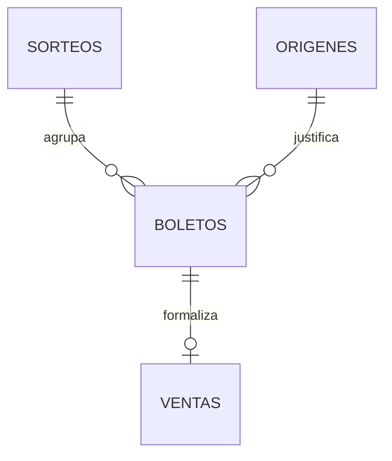

# Estructura de la base de datos

> Versión actualizada según el documento «2.1. Diagrama de Arquitectura y Base de Datos».

## 1. Objetivo

Este documento define la estructura de persistencia para la aplicación de gestión de lotería del Mercado de Colón. El modelo cubre:

- Registro e importación de albaranes.
- Almacenamiento de los PDF de los albaranes.
- Inventario de décimos individuales.
- Venta de un único décimo por operación.
- Consulta y edición de ventas.
- Eliminación reversible de ventas.
- Arqueo y análisis de ventas.
- Funcionamiento 100 % local, sin dependencia de Internet.
- Soporte para varios tipos de juego, no solo Lotería Nacional.

El documento se basa en la versión proporcionada del PDF, en las decisiones funcionales facilitadas para el proyecto y en las entidades que actualmente existen en `lib/record-data.ts` y `lib/tpv-data.ts`.

## 2. Decisiones funcionales

| Decisión | Diseño aplicado |
| --- | --- |
| Cada ticket representa un décimo individual | Cada registro de `boletos` identifica un número, serie y fracción concretos. |
| Una venta contiene varios tickets | No. Cada fila de `ventas` corresponde exactamente a un boleto. |
| Devoluciones | No se modelan como devolución independiente. La eliminación de una venta se registra como anulación reversible. |
| Ventas anuladas | Se conservan y pueden revertirse. No se borran físicamente. |
| Usuarios | En la primera versión no se incluye gestión de usuarios. Se deja preparado el campo de origen de la operación. |
| PDF de albaranes | Se conserva el archivo y sus metadatos. |
| Trabajo sin conexión | Toda la aplicación y la base de datos se ejecutan localmente. No se necesita sincronización para operar. |
| Precio | El precio pertenece al sorteo. Las ventas no permiten modificarlo. |
| Varios juegos | Los sorteos se relacionan con un catálogo de tipos de juego. |

## 3. Arquitectura del sistema

El sistema seguirá un **monolito modular 100 % local**, desplegado en el ordenador de administración y preparado para una futura versión con acceso remoto.

1. **Frontend**: Next.js y React para inventario, registro, TPV y análisis. La interfaz estará optimizada para escritorio, teclado, ratón y pistola escáner.
2. **Backend**: API REST ejecutada en `localhost`. Será responsable de validar stock, decodificar códigos SELAE y aplicar las transacciones.
3. **Base de datos**: sistema relacional local con transacciones ACID. Se podrá usar SQLite para la primera instalación de un único puesto o PostgreSQL si se necesita crecer hacia varios puestos.
4. **Contenedores**: Docker encapsulará la aplicación y el almacenamiento persistente.

La conexión a Internet no forma parte del funcionamiento normal. El despliegue debe incluir un volumen persistente para la base de datos, los PDF y las copias de seguridad.

No se debe depender del estado React como fuente de verdad. Los arrays actuales de `tickets` y `sales` son datos de demostración y deben sustituirse por llamadas al backend local.

## 4. Modelo entidad-relación



## 5. Tablas principales

  El esquema base del PDF está formado por cuatro tablas. La relación entre `BOLETOS` y `VENTAS` es 1 a 0..1: un boleto disponible no tiene venta y un boleto vendido tiene una venta.

### 5.1 `sorteos`

Tabla central de campañas y sorteos. `id_sorteo` puede ser una clave de texto como `52026102`, formada por `tipo_juego + año_completo + numero_sorteo`.

| Campo | Tipo | Reglas |
| --- | --- | --- |
| `id_sorteo` | VARCHAR(20) | Clave primaria |
| `tipo_juego` | INTEGER | Código SELAE, por ejemplo `5` |
| `ano_emision` | INTEGER | Último dígito del año del código |
| `ano_completo` | INTEGER | Año de cuatro dígitos |
| `numero_sorteo` | INTEGER | Número del sorteo en el calendario |
| `nombre_sorteo` | VARCHAR(150) | Descripción de la campaña |
| `precio_unitario` | NUMERIC(10,2) | Precio oficial del décimo |

El precio se consulta desde esta tabla. La venta no permite modificarlo. `tipo_juego` permite incorporar otros juegos además de Lotería Nacional.

### 5.2 `origenes`

Registra de dónde procede cada alta de inventario.

| Campo | Tipo | Reglas |
| --- | --- | --- |
| `id_origen` | VARCHAR(80) | Clave primaria; albarán o ID autogenerado |
| `tipo_origen` | VARCHAR(20) | `Albarán`, `Manual` o `Lectura` |
| `nombre_albaran` | VARCHAR(200) | Extraído del PDF cuando proceda |
| `fecha_hora_carga` | TIMESTAMP | Momento de procesamiento |
| `pdf_path` | VARCHAR(500) | Ruta local del PDF conservado |
| `pdf_checksum` | VARCHAR(128) | Evita importar el mismo PDF dos veces |

El PDF se almacena en un volumen persistente local de Docker y la base de datos conserva su ruta y checksum.

### 5.3 `boletos`

Inventario maestro. Cada registro representa un décimo físico individual.

| Campo | Tipo | Reglas |
| --- | --- | --- |
| `id_boleto` | VARCHAR(100) | Clave primaria: sorteo + número + serie + fracción |
| `id_sorteo` | VARCHAR(20) | FK a `sorteos`, obligatorio |
| `id_origen` | VARCHAR(80) | FK a `origenes`, obligatorio |
| `numero_jugado` | CHAR(5) | Cinco cifras, posiciones 13 a 17 |
| `serie` | CHAR(3) | Posiciones 8 a 10 |
| `fraccion` | CHAR(2) | Posiciones 6 y 7 |
| `digitos_control` | CHAR(4) | Posiciones 18 a 21 |
| `codigo_barras_raw` | VARCHAR(100) | Código completo escaneado |
| `fecha_hora_registro` | TIMESTAMP | Alta o lectura del décimo |

La clave de `id_boleto` evita duplicar un décimo físico. Se recomienda conservar además una restricción única sobre `(id_sorteo, numero_jugado, serie, fraccion)`.

### 5.4 `ventas`

Registra la salida de un décimo. La clave primaria es también clave foránea a `boletos`, por lo que cada boleto solo puede tener una venta.

| Campo | Tipo | Reglas |
| --- | --- | --- |
| `id_boleto` | VARCHAR(100) | PK y FK a `boletos` |
| `fecha_hora_venta` | TIMESTAMP | Momento del despacho |
| `estado` | VARCHAR(20) | `activa` o `anulada` |
| `fecha_hora_anulacion` | TIMESTAMP | Se rellena al anular |
| `motivo_anulacion` | VARCHAR(255) | Opcional |

El esquema del PDF representa la venta mediante la existencia de una fila. Para conservar ventas anuladas y permitir revertirlas, la implementación añade `estado` y marca la fila como `anulada` en lugar de borrarla físicamente. Una venta anulada no cuenta en el arqueo.

Como no se permiten ventas con varios tickets, no se necesita una tabla de cabecera y líneas: cada fila de `ventas` corresponde exactamente a un décimo.

## 6. Persistencia local y copias de seguridad

La base de datos se ejecutará en el ordenador de administración y seguirá disponible sin conexión a Internet. La aplicación no dependerá de IndexedDB ni de una cola de sincronización entre dispositivos.

Se recomienda:

- **SQLite** para la primera instalación de un único ordenador, por su sencillez y bajo mantenimiento.
- **PostgreSQL local** si la futura versión necesita varios procesos o varios puestos conectados al equipo servidor.
- **Docker Compose** para ejecutar el backend, la aplicación y el volumen persistente.
- Un volumen separado para la base de datos, los PDF y las copias de seguridad.
- Copias automáticas locales y una copia externa periódica, sin convertirla en dependencia del funcionamiento diario.

El PDF original del albarán debe conservarse en el volumen de documentos. `origenes.pdf_path` y `origenes.pdf_checksum` permiten localizarlo y detectar importaciones repetidas.

## 7. Transacciones de negocio

### Registrar una venta

```text
BEGIN
1. Bloquear el boleto solicitado.
2. Comprobar que existe y está disponible.
3. Leer el precio del sorteo.
4. Crear la fila de `ventas` con `estado = activa`.
COMMIT
```

Si falla cualquier paso, se hace `ROLLBACK`.

### Anular una venta

```text
BEGIN
1. Bloquear la venta.
2. Comprobar que está `activa`.
3. Cambiar `ventas.estado` a `anulada`.
4. Registrar la fecha y el motivo de la anulación.
COMMIT
```

### Restaurar una venta anulada

```text
BEGIN
1. Bloquear la venta y su boleto.
2. Comprobar que la venta está `anulada`.
3. Comprobar que el boleto no tiene otra venta activa.
4. Cambiar `ventas.estado` a `activa`.
5. Vaciar los datos de anulación.
COMMIT
```

Si el boleto fue vendido entretanto, la restauración se rechaza y se conserva el registro de la venta anulada.

### Editar una venta

La edición debe comprobar que el nuevo ticket está disponible. Si se cambia el ticket:

1. Bloquear venta, boleto antiguo y boleto nuevo.
2. Anular la venta antigua conservando su historial.
3. Crear la venta del nuevo boleto.
4. Mantener el precio definido en el sorteo del nuevo boleto.

No se permite editar libremente el precio.

## 8. Reglas de integridad

- Los números, series y fracciones se almacenan como texto o tipos numéricos con formato controlado para conservar ceros iniciales.
- Un boleto solo puede pertenecer a un sorteo y a un origen.
- No puede existir más de un boleto con la misma combinación de sorteo, número, serie y fracción.
- Un boleto vendido debe tener exactamente una venta `activa`.
- Una venta anulada no cuenta en ingresos ni en unidades vendidas.
- Una venta anulada conserva su fila, su fecha original y sus datos de anulación.
- El precio se obtiene del sorteo asociado al boleto y no se edita desde `ventas`.
- Los importes se almacenan como `NUMERIC(10,2)`, nunca como `float`.
- Un albarán no se puede procesar dos veces con el mismo `id_origen` o checksum.
- La suma de boletos generados desde un albarán debe coincidir con su cantidad declarada, salvo que el origen se marque explícitamente como error.

## 9. Consultas para inventario y análisis

### Inventario

El inventario disponible se obtiene con:

```text
SELECT *
FROM boletos b
WHERE NOT EXISTS (
  SELECT 1
  FROM ventas v
  WHERE v.id_boleto = b.id_boleto
    AND v.estado = 'activa'
)
ORDER BY numero_jugado, serie, fraccion;
```

### Arqueo

Solo se suman ventas efectivas:

```text
SELECT
  COUNT(*) AS operations,
  COALESCE(SUM(s.precio_unitario), 0) AS income
FROM ventas v
JOIN boletos b ON b.id_boleto = v.id_boleto
JOIN sorteos s ON s.id_sorteo = b.id_sorteo
WHERE v.estado = 'activa'
  AND v.fecha_hora_venta >= :from_date
  AND v.fecha_hora_venta < :to_date;
```

### Ventas por día

La agrupación debe usar la zona horaria del establecimiento, no la del servidor si son diferentes.

## 10. Plan de implementación

### Fase 1: persistencia local

1. Elegir SQLite para la primera instalación local.
2. Crear las tablas `sorteos`, `origenes`, `boletos` y `ventas` mediante migraciones.
3. Crear el volumen Docker para base de datos, PDF y copias de seguridad.
4. Migrar los datos de demostración actuales.
5. Sustituir el estado principal de `app/page.tsx` por consultas al backend local.

### Fase 2: dominio de ventas

1. Implementar `createSale`.
2. Implementar `voidSale`.
3. Implementar `restoreSale`.
4. Implementar `updateSale`.
5. Añadir pruebas de doble venta, anulación y restauración.

### Fase 3: importación de albaranes

1. Guardar PDF y checksum.
2. Extraer del PDF el identificador y el nombre visible del albarán.
3. Crear el registro en `origenes`.
4. Generar boletos individuales en `boletos`.
5. Evitar duplicados.
6. Registrar errores de importación.

### Fase 4: API local y despliegue

1. Crear la API REST en `localhost`.
2. Implementar el decodificador del código de barras SELAE.
3. Ejecutar frontend, backend y base de datos mediante Docker.
4. Configurar el volumen persistente y las copias de seguridad.
5. Medir que las operaciones habituales respondan por debajo de 200 ms.

### Fase 5: análisis y operación

1. Migrar las métricas de inventario y TPV a consultas del servidor.
2. Excluir ventas anuladas de los totales.
3. Añadir restauración de ventas.
4. Verificar cierres de caja y zona horaria.
5. Añadir comprobaciones de integridad y recuperación de copias.

## 11. Criterios de aceptación

- La aplicación puede registrar y consultar boletos sin conexión a Internet.
- Una venta contiene un único décimo.
- El mismo boleto no puede venderse dos veces.
- El precio se obtiene del sorteo y no puede modificarse desde una venta.
- Eliminar una venta la marca como anulada, libera el boleto y conserva el historial.
- Una venta anulada puede restaurarse si el ticket continúa disponible.
- Los PDF de los albaranes se conservan y pueden asociarse al inventario generado.
- Se pueden registrar distintos tipos de juego y sus sorteos.
- Los análisis no incluyen ventas anuladas.
- La aplicación arranca y opera con la base de datos local aunque no haya Internet.
- Las copias de seguridad permiten recuperar la base de datos y los PDF.
