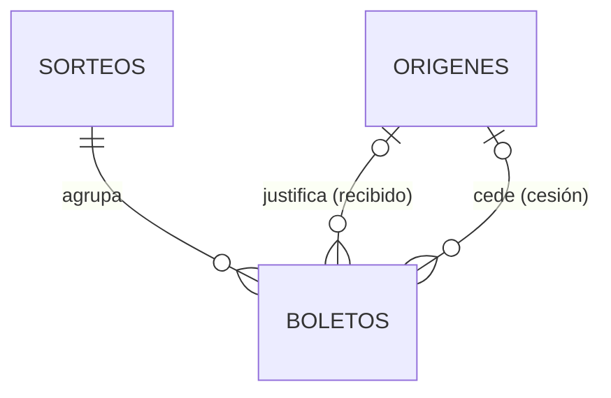

# Estructura de la base de datos

> Estado a octubre de 2026. La venta y la cesión de un décimo son estados del propio boleto (ya no existen las tablas `ventas` y `cedidos`), los sorteos se configuran en `sorteos.json` y el código de barras se guarda sin el separador de la posición 11.
>
> Documentos relacionados: [codigo-barras-seleae.md](codigo-barras-seleae.md) (estructura del código de barras) y [despliegue.md](despliegue.md) (instalación, copias de seguridad y migración de bases antiguas).

## 1. Objetivo

Este documento define la estructura de persistencia para la aplicación de gestión de lotería del Mercado de Colón. El modelo cubre:

- Registro e importación de albaranes.
- Almacenamiento de los PDF de los albaranes.
- Inventario de décimos individuales.
- Cesión de décimos a otras administraciones.
- Venta de un único décimo por operación.
- Consulta y edición de ventas.
- Eliminación reversible de ventas.
- Arqueo y análisis de ventas.
- Funcionamiento 100 % local, sin dependencia de Internet.
- Soporte para varios tipos de juego, no solo Lotería Nacional.
- Sorteos configurables desde un archivo, sin tocar el código.

El documento se basa en la versión proporcionada del PDF, en las decisiones funcionales facilitadas para el proyecto y en las entidades que actualmente existen en `lib/record-data.ts` y `lib/tpv-data.ts`.

## 2. Decisiones funcionales

| Decisión | Diseño aplicado |
| --- | --- |
| Cada ticket representa un décimo individual | Cada registro de `boletos` identifica un número, serie y fracción concretos. |
| Una venta contiene varios tickets | No. Cada venta corresponde exactamente a un boleto. |
| Devoluciones | No se modelan como devolución independiente. La eliminación de una venta se registra como anulación reversible. |
| Ventas anuladas | Se conservan en el boleto y pueden revertirse. No se borran físicamente salvo la acción explícita de borrado permanente. |
| Usuarios | En la primera versión no se incluye gestión de usuarios. Se deja preparado el campo de origen de la operación. |
| PDF de albaranes | Se conserva el archivo y sus metadatos. |
| Trabajo sin conexión | Toda la aplicación y la base de datos se ejecutan localmente. No se necesita sincronización para operar. |
| Precio | El precio pertenece al sorteo. Las ventas no permiten modificarlo. |
| Varios juegos | Los sorteos se relacionan con un catálogo de tipos de juego. |

## 3. Arquitectura del sistema

La aplicación es un **monolito local 100 % sin conexión**, instalado en el ordenador de administración:

1. **Frontend**: Next.js y React para inventario, registro, TPV y análisis. La interfaz está pensada para escritorio, teclado, ratón y pistola escáner.
2. **Backend**: Route Handlers de Next.js ejecutados en `localhost` (`app/api/`). Validan el stock, interpretan los códigos SELAE y aplican las transacciones.
3. **Base de datos**: SQLite local gestionada con Prisma (transacciones ACID). No hay servidor de base de datos ni Docker. Si en el futuro se necesitaran varios puestos, el modelo se podría llevar a PostgreSQL.
4. **Archivos**: los PDF de los albaranes se guardan en `data/albaranes/<id>.pdf` y la base conserva su ruta y su checksum.

La conexión a Internet no forma parte del funcionamiento normal. La base de datos y la configuración (`database-location.json`, `sorteos.json`) viven en `%LOCALAPPDATA%\LoteriaMercatDeColon` (variables `LOTERIA_CONFIG_DIR` y `LOTERIA_DATA_DIR`).

La fuente de verdad es la base de datos: la interfaz carga inventario, ventas, cedidos y orígenes desde la API y los recarga tras cada operación.
## 4. Modelo entidad-relación


```mermaid
erDiagram
    SORTEOS ||--o{ BOLETOS : agrupa
    ORIGENES |o--o{ BOLETOS : "justifica (recibido)"
    ORIGENES |o--o{ BOLETOS : "cede (cesión)"
```

## 5. Tablas principales

El esquema está formado por tres tablas: `sorteos`, `origenes` y `boletos`. La venta y la cesión de un décimo son estados del propio boleto (`estado`).

### 5.1 `sorteos`

Tabla central de campañas y sorteos. `id_sorteo` puede ser una clave de texto como `52026102`, formada por `tipo_juego + año_completo + numero_sorteo`.

| Campo | Tipo | Reglas |
| --- | --- | --- |
| `id_sorteo` | VARCHAR(20) | Clave primaria |
| `tipo_juego` | INTEGER | Código SELAE, por ejemplo `5` |
| `ano_emision` | INTEGER | Último dígito del año del código |
| `ano_completo` | INTEGER | Año de cuatro dígitos |
| `numero_sorteo` | INTEGER | Número del sorteo en el calendario |
| `nombre_sorteo` | VARCHAR(150) | Descripción de la campaña |
| `precio_unitario_centimos` | INTEGER | Precio del décimo en céntimos (`2000` = 20 €) |
| `created_at`, `updated_at` | TIMESTAMP | Control interno |

El precio se consulta desde esta tabla. La venta no permite modificarlo. `tipo_juego` permite incorporar otros juegos además de Lotería Nacional.

#### Configuración de sorteos (`sorteos.json`)

Los sorteos se definen en el archivo `sorteos.json`, en la carpeta de configuración (`LOTERIA_CONFIG_DIR`, junto a `database-location.json`). El nombre del juego («Lotería Nacional») no se guarda en la base de datos: se obtiene del catálogo `juegos` de ese archivo a partir de `tipo_juego`.

```json
{
  "juegos": { "5": "Lotería Nacional" },
  "sorteos": [
    { "tipoJuego": 5, "anoCompleto": 2026, "numeroSorteo": 102, "nombre": "Sorteo Extraordinario de Navidad 2026", "precioCentimos": 2000 }
  ]
}
```

- La tabla `sorteos` se mantiene porque `boletos` y `origenes` la referencian. El archivo es la fuente editable y la tabla se sincroniza con él.
- Si el archivo no existe se crea a partir de los sorteos de la base, y los sorteos de la base que falten en el archivo se añaden.
- Un albarán con un sorteo que no está en el archivo lo crea con los datos leídos (nombre genérico «Sorteo NNN de AAAA» y precio por defecto de 20 €) y lo anota en el archivo.
- El alta manual solo admite sorteos ya configurados.
- El nombre del archivo manda sobre el de la base. El precio del archivo solo se aplica a la base mientras el sorteo no tenga ventas; desde la pestaña Registro se puede cambiar con una confirmación previa.
- La pestaña Registro incluye el apartado «Sorteos» para añadir sorteos y modificar su nombre y precio. El juego, el año y el número no se pueden cambiar una vez creado el sorteo.

### 5.2 `origenes`

Registra de dónde procede cada alta de inventario y también los albaranes de cesión.

| Campo | Tipo | Reglas |
| --- | --- | --- |
| `id_origen` | VARCHAR(80) | Clave primaria: número del albarán, o un identificador provisional `MAN-AAAA-MM-DD-HH-MM-SS` (alta manual) o `SCAN-…` (alta con lector) |
| `id_sorteo` | VARCHAR(20) | FK opcional a `sorteos` |
| `id_receptor_admin` | VARCHAR(40) | Administración receptora que figura en el albarán |
| `tipo_origen` | VARCHAR(60) | Tipo leído del PDF (`Pedidos sobre Reserva No Fabricada`, `Abonos Fijos`, `Distribución Libre`, `Números y/o Terminaciones Especiales`, `Recepción del Cambio Consignación`, `Cesión de Consignación`…), o `Manual` / `Escaner` en las altas sin albarán |
| `fecha_hora_carga` | TIMESTAMP | Momento de procesamiento |
| `fecha_emision` | TIMESTAMP | Fecha de emisión que figura en el albarán |
| `total_numeros`, `total_series`, `total_billetes` | INTEGER | Totales declarados en el PDF |
| `pdf_path` | VARCHAR(500) | Ruta local del PDF conservado |
| `pdf_checksum` | VARCHAR(128) | Único: evita importar el mismo PDF dos veces |
| `deleted_at` | TIMESTAMP | Borrado lógico de la carga |

Un albarán de **cesión** no aporta boletos propios: sus boletos se marcan como `cedido` y apuntan a él con `id_origen_cesion`.

Los orígenes provisionales (`MAN-`, `SCAN-`) se sustituyen por el albarán definitivo cuando este se carga y trae los mismos boletos.
### 5.3 `boletos`

Un registro por décimo físico. Reúne su inventario, su venta y su cesión (antes eran las tablas `boletos`, `ventas` y `cedidos`).

| Campo | Tipo | Reglas |
| --- | --- | --- |
| `id_boleto` | VARCHAR(100) | Clave primaria: sorteo + número + serie + fracción |
| `id_sorteo` | VARCHAR(20) | FK a `sorteos`, obligatorio |
| `id_origen` | VARCHAR(80) | FK a `origenes`. Nulo si el boleto aún no se ha recibido |
| `numero_jugado` | CHAR(5) | Cinco cifras, posiciones 13 a 17 |
| `serie` | CHAR(3) | Posiciones 8 a 10 |
| `fraccion` | CHAR(2) | Posiciones 6 y 7 |
| `digitos_control` | CHAR(4) | Posiciones 18 a 21. `0000` hasta que se lee con el escáner |
| `codigo_barras_raw` | CHAR(20) | Código de barras de 20 caracteres, sin el separador de la posición 11. Construido (con control `0000`) hasta que se lee con el escáner; ver [codigo-barras-seleae.md](codigo-barras-seleae.md) |
| `fecha_hora_registro` | TIMESTAMP | Alta o lectura del décimo |
| `estado` | VARCHAR(20) | `disponible`, `vendido` o `cedido` |
| `fecha_hora_venta` | TIMESTAMP | Momento de la venta; se conserva si se anula |
| `fecha_hora_anulacion` | TIMESTAMP | Se rellena al anular la venta |
| `motivo_anulacion` | VARCHAR(255) | Opcional |
| `fecha_hora_cesion` | TIMESTAMP | Momento de la cesión |
| `id_origen_cesion` | VARCHAR(80) | FK a `origenes`: albarán de cesión |

La restricción única `(id_sorteo, numero_jugado, serie, fraccion)` evita duplicar un décimo físico.

Como no se permiten ventas con varios tickets, no hay tabla de cabecera y líneas: cada venta es un boleto. Una venta anulada es un boleto `disponible` con `fecha_hora_anulacion`, y no cuenta en el arqueo.

Un boleto con `id_origen` nulo es un décimo vendido o cedido cuyo albarán de entrada no está cargado. Al cargarlo, el albarán rellena `id_origen` y el boleto conserva su venta o su cesión.

## 6. Persistencia local y copias de seguridad

La base de datos (`loteria.db`) se ejecuta en el ordenador de administración y sigue disponible sin conexión a Internet. La aplicación no depende de IndexedDB ni de una cola de sincronización.

- **Copias de seguridad**: la aplicación permite descargar una copia desde Registro. Antes de actualizar o migrar una base real, copia siempre `loteria.db`.
- **Importar una base** desde Registro: se guarda la actual como `loteria.db.antes-de-importar`, se migra la importada a la estructura vigente y, si la migración falla, se restaura la anterior.
- **Bases con la estructura antigua** (tablas `ventas` y `cedidos`): `pnpm db:migrar -- "ruta\antigua.db"` las migra sobre una copia sin tocar la original. Ver [despliegue.md](despliegue.md).
- **PDF** de los albaranes: `data/albaranes`, con su ruta y checksum en `origenes`.
## 7. Transacciones de negocio

Todas operan sobre el boleto y se ejecutan en una transacción (`ROLLBACK` si falla cualquier paso).

### Registrar una venta

```text
BEGIN
1. Localizar el boleto. Si no existe y se ha escaneado su código, crearlo sin origen (no recibido).
2. Rechazar si está cedido o ya vendido.
3. estado = 'vendido', fecha_hora_venta = ahora y vaciar los datos de anulación.
4. Si se ha escaneado el código, guardar sus digitos_control y su codigo_barras_raw (20 caracteres, sin separador).
COMMIT
```

El sorteo de un boleto nuevo se obtiene del código escaneado (juego, número de sorteo y última cifra del año) entre los sorteos configurados.

### Anular una venta

```text
BEGIN
1. Comprobar que el boleto está 'vendido'.
2. estado = 'disponible'.
3. Registrar fecha_hora_anulacion y motivo_anulacion (se conserva fecha_hora_venta).
COMMIT
```

### Restaurar una venta anulada

```text
BEGIN
1. Comprobar que el boleto está 'disponible' y tiene fecha_hora_anulacion.
2. Comprobar que su origen no está eliminado.
3. estado = 'vendido' y vaciar los datos de anulación.
COMMIT
```

### Editar una venta

Se puede cambiar la fecha o trasladar la venta a otro boleto. El boleto de destino debe estar disponible (un destino cedido o vendido se rechaza): la venta se libera en el boleto antiguo y se crea en el nuevo. No se permite editar el precio.

### Ceder boletos (albarán de cesión)

```text
BEGIN
1. Si algún boleto está vendido o ya cedido en otro albarán, no se guarda nada y se pregunta al usuario: dejarlo vendido o marcarlo cedido (la venta queda anulada), o qué albarán lo cedió.
2. estado = 'cedido', fecha_hora_cesion e id_origen_cesion en los boletos existentes.
3. Crear, sin origen, los boletos que aún no se han recibido.
COMMIT
```

Eliminar el albarán de cesión la deshace: los boletos no recibidos y sin venta se eliminan y el resto vuelve a `disponible` (una venta anulada por la cesión se puede restaurar). Reimportar el mismo albarán respeta los boletos que ya cedió.

### Recibir un albarán de entrada

Los boletos que ya existían sin origen (vendidos o cedidos antes de cargar el albarán) o con un origen provisional (alta manual o por escáner) se asignan al albarán conservando su estado. Si un boleto ya tiene otro origen real, se pregunta al usuario cuál es el correcto.

### Deshacer una venta recién hecha

El botón «Deshacer» del Inventario anula la venta en el servidor (queda en el historial y se puede restaurar).

## 8. Reglas de integridad

- Los números, series y fracciones se almacenan como texto para conservar ceros iniciales.
- Un boleto pertenece a un sorteo y, una vez recibido, a un origen.
- No puede existir más de un boleto con la misma combinación de sorteo, número, serie y fracción.
- `estado` es `disponible`, `vendido` o `cedido`, y son excluyentes: **un boleto cedido no se puede vender** y uno vendido no se puede ceder sin que el usuario decida qué es en realidad (venta o cesión).
- Un boleto `vendido` tiene `fecha_hora_venta`; uno `cedido` tiene `fecha_hora_cesion` e `id_origen_cesion`. Un cedido puede conservar una venta anulada («Era una cesión») como rastro.
- Una venta anulada deja el boleto `disponible` conservando `fecha_hora_venta`, `fecha_hora_anulacion` y `motivo_anulacion`. No cuenta en ingresos ni en unidades vendidas.
- Un boleto solo guarda una venta: si se vuelve a vender o se cede, la venta anulada anterior se sustituye.
- Un boleto sin `id_origen` **no está recibido**: su albarán de entrada aún no se ha cargado. Puede venderse o cederse igualmente y se «adopta» al cargar el albarán (alta por albarán o alta manual), conservando su estado.
- Los dígitos de control (`digitos_control`) valen `0000` al importar un albarán y se actualizan con la lectura del escáner al vender el boleto.
- El precio se obtiene del sorteo asociado al boleto y no se edita desde la venta.
- Los importes se almacenan en céntimos enteros, nunca como `float`.
- Un albarán no se puede procesar dos veces con el mismo `id_origen` o checksum.
- Las transiciones de estado se aplican solo desde `lib/boleto-estado.ts`, para que no queden estados imposibles. Prisma reconstruye las tablas de SQLite en cada migración y perdería cualquier `CHECK`, por eso no se definen en la base de datos.

## 9. Consultas para inventario y análisis

### Inventario

El stock disponible es el de los boletos recibidos en estado `disponible`:

```text
SELECT *
FROM boletos
WHERE estado = 'disponible'
  AND id_origen IS NOT NULL
ORDER BY numero_jugado, serie, fraccion;
```

Stock = recibidos − cedidos − vendidos, donde «recibidos» son los boletos con `id_origen`.

### Arqueo

Solo se suman ventas efectivas:

```text
SELECT
  COUNT(*) AS operations,
  COALESCE(SUM(s.precio_unitario_centimos), 0) AS income
FROM boletos b
JOIN sorteos s ON s.id_sorteo = b.id_sorteo
WHERE b.estado = 'vendido'
  AND b.fecha_hora_venta >= :from_date
  AND b.fecha_hora_venta < :to_date;
```

### Ventas por día

La agrupación debe usar la zona horaria del establecimiento, no la del servidor si son diferentes.

## 10. Estado de la implementación

| Área | Estado |
| --- | --- |
| Persistencia local con SQLite, Prisma y migraciones | Hecho |
| Venta, anulación, restauración, edición y edición por grupos desde el TPV | Hecho |
| Importación de albaranes PDF de entrada y de cesión, con PDF y checksum conservados | Hecho |
| Preguntas al usuario cuando un albarán choca con el estado u origen de un boleto | Hecho |
| Boletos vendidos o cedidos antes de cargar su albarán (sin origen) | Hecho |
| Decodificación del código SELAE y dígitos de control actualizados con el escáner | Hecho |
| Sorteos configurables (`sorteos.json`) y editables desde Registro | Hecho |
| Migración de bases con la estructura antigua | Hecho (`pnpm db:migrar` e importación) |
| Paquete portable de Windows | Hecho |
| Docker, PostgreSQL y varios puestos | No previsto por ahora |
| Verificación de cierres de caja y zona horaria | Pendiente de revisión |
| Comprobaciones automáticas de integridad y recuperación de copias | Pendiente |
## 11. Criterios de aceptación

- La aplicación puede registrar y consultar boletos sin conexión a Internet.
- Una venta contiene un único décimo.
- El mismo boleto no puede venderse dos veces.
- El precio se obtiene del sorteo y no puede modificarse desde una venta.
- Eliminar una venta la marca como anulada, libera el boleto y conserva el historial.
- Una venta anulada puede restaurarse si el ticket continúa disponible.
- Los PDF de los albaranes se conservan y pueden asociarse al inventario generado.
- Se pueden registrar distintos tipos de juego y sus sorteos.
- Los análisis no incluyen ventas anuladas.
- La aplicación arranca y opera con la base de datos local aunque no haya Internet.
- Las copias de seguridad permiten recuperar la base de datos y los PDF.
- Un boleto cedido no se puede vender.
- Un boleto se puede vender o ceder antes de cargar su albarán de entrada y lo conserva al cargarlo.
- Si un albarán choca con el estado u origen de un boleto, se pregunta al usuario y no se guarda nada hasta que responde.
- Al leer el código de barras en una venta se actualizan los dígitos de control y el código de barras (20 caracteres, sin separador).
- Una base con la estructura antigua se puede migrar sin modificar la original.
